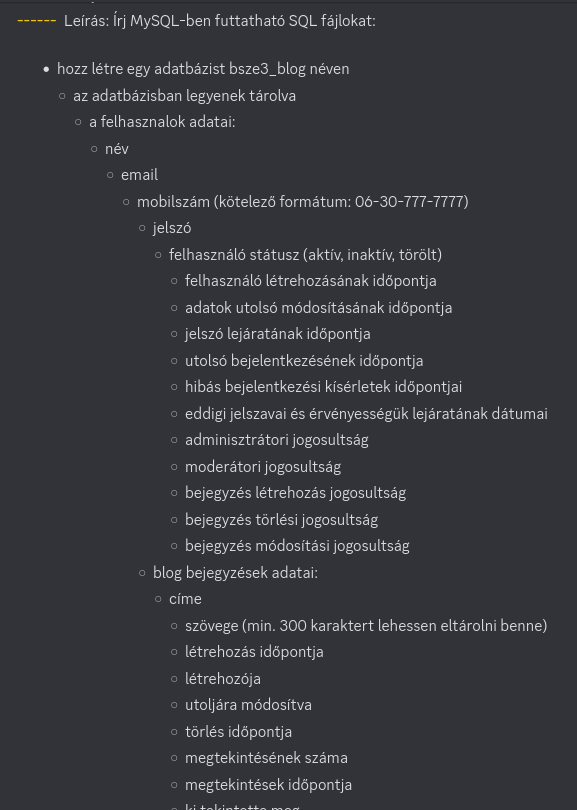
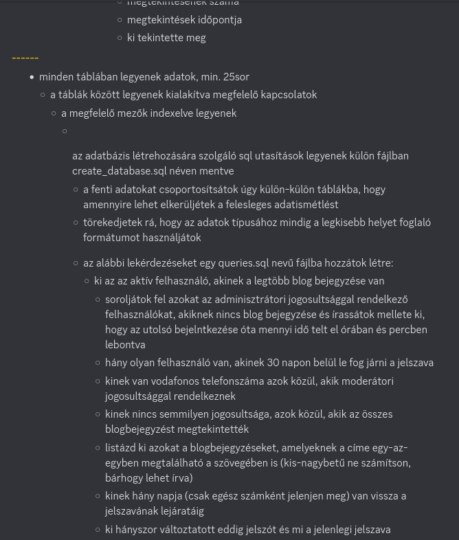
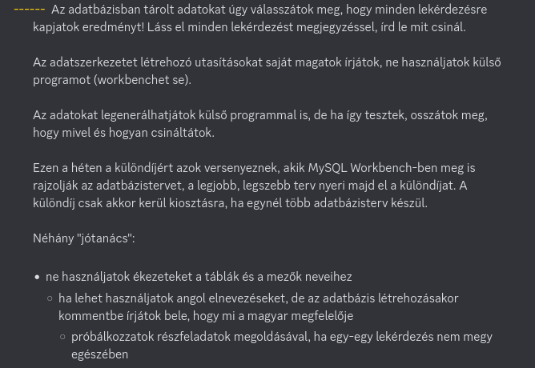
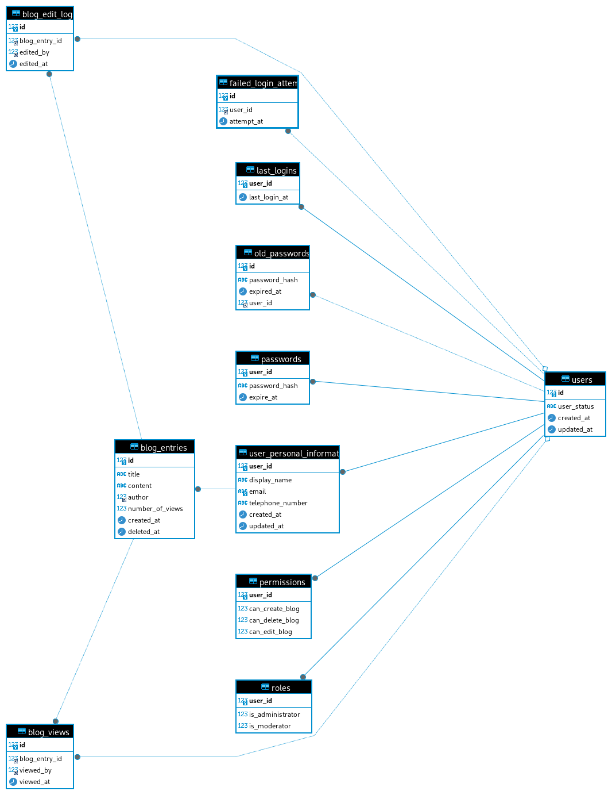

# Megjegyzés:
Kicsit több időt töltöttem olyannal, amivel nem kellett volna. Volt pár problémám, de ezt bele is írtam az adott C# fájlokba.
Nem igazán vagyok elégedett az eredménnyel, de nem akartam már kérdezősködni az időlejárata fele.

Feladat leírása:  


  
ER diagram:  


# Usage / Building

Files in *Bsze3Blog.Models* are **auto generated** by EF tool, don't touch it!  
Except the following files:  

- Bsze3Blog.Models.csproj
- create_database.sql
- OnConfiguring.cs

Copy the example appsettings:  
```bash
cp Bsze3Blog.PopulateDB/appsettings.Example.json Bsze3Blog.PopulateDB/appsettings.json
```  
Then change the ConnectionStrings according to your needs.  
Populate the database with random data:  
```bash
dotnet run --project Bsze3Blog.PopulateDB/Bsze3Blog.PopulateDB.csproj
```  
Generate models (Don't forget to create/update/modify the database first & delete unused .cs files):  
```bash
dotnet ef dbcontext scaffold "Server=127.0.0.1;User ID=root;Password=;Database=bsze3_blog" "Pomelo.EntityFrameworkCore.MySql" -f -p Bsze3Blog.Models/Bsze3Blog.Models.csproj --no-onconfiguring
```
