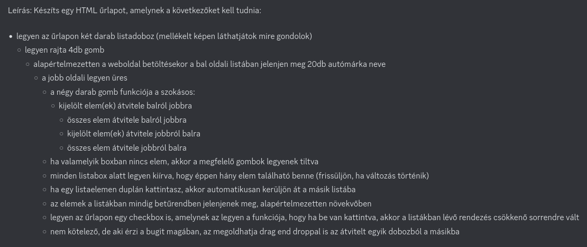
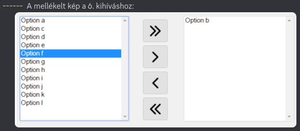

# Megjegyzés:
Nem gondoltam át elégé a feladatot.  
[Sortable](https://github.com/SortableJS/Sortable) létezéséről tudtam már, így némileg közre játszott, hogy így oldottam meg, ahogy. Drag n drop-al nem foglalkoztam.  
Pár saját észrevétel utólag:

- Mivel kettőnél többet nem tudok összekötni, így ez a group-os megoldás/elnevezés megtévesztő
- Túl sok mindent kell átadni a class-nak, ami csúnyán nézz ki
- A constructor szerintem túl sok mindent tartalmaz
- A CustomEvent használata lehet nem volt jó ötlet, túlzának érzem így utólag.
- Valamivel megakartam különbözteti a két List-et, miközben nem adom át az egész osztályt az eventen keresztül, ezért a Symbol()-t választottam, ami nem tudom, hogy most épp rossz dolog e vagy sem
- Nem teszteltem, hogy mi a helyzet ha ul/ol listában más html tagok is szerepelnek

Feladat leírása:  

